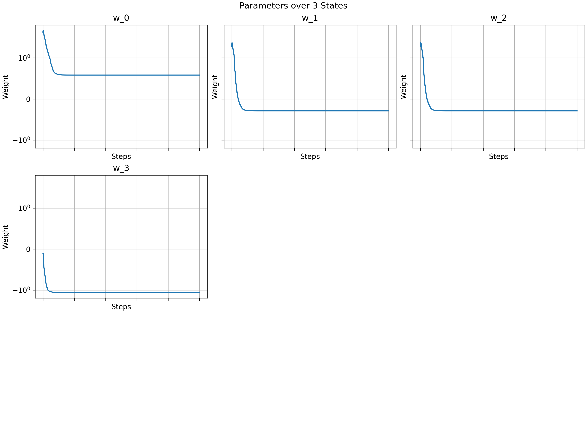
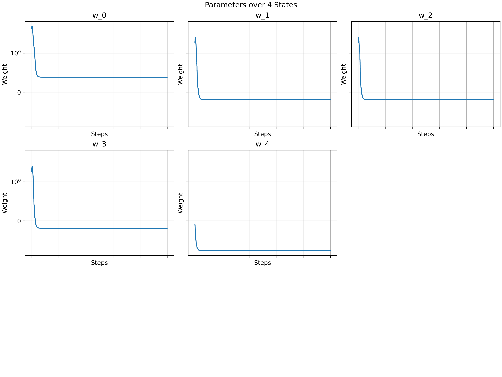
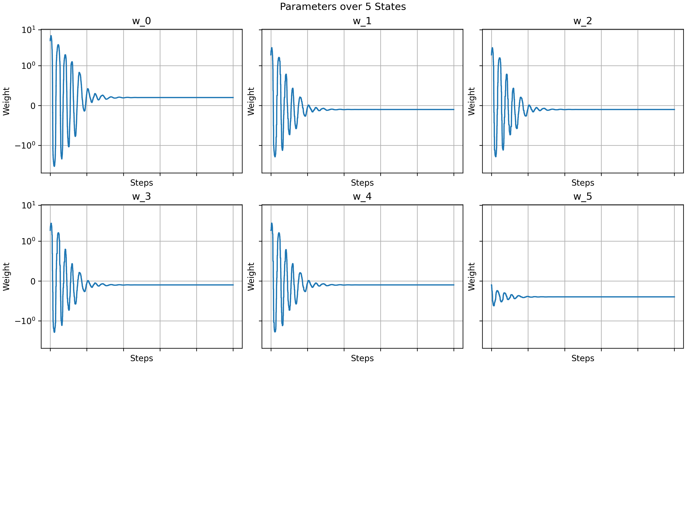

# How Many Intermediate States Could Baird's Counterexample Have?
## Table of Contents
1. Abstract
2. Introduction
3. Run the Code

## Abstract

## Introduction
Baird's Counterexample is a Markov Decision Process (MDP) whose original formulation consists of the following:
- State space $S = \{s_i\}_{i = 0}^n$ where $n = 5$, none of which are terminal,
- Action space $A = \{a_0, a_1\}$,
- Dynamics: 
```math
\begin{align*}
\text{Pr}[S_{t+1} = s_0 \mid A_t = a_0] &= 1\\
\text{Pr}[S_{t+1} = s_i \mid A_t = a_1] &= \frac{1}{n} \quad i \neq 0
\end{align*}
```
- There is no reward for any transition.

This MDP demonstrates that an RL algorithm that:
1. Is Off-policy,
2. Utilises bootstrapping, and
3. Utilises function approximation to compute the value function $v$ through a set of weights $\vec{w}$

will not converge. More specificlly, the weights vector $\vec{w}$ will diverge, no matter how
many steps in an episode of the MDP the algorithm learns from.

The MDP was first proposed by Baird in 1995 [1], and has since been used to test off-policy algorithms. However, we have
observed that the number of states has not remained consistent throughout all research that has utilised Baird's
Counterexample. Although the original schema featured 6 states as we have described above, numerous papers have included 7
states, where $n = 6$ instead.

<!-- Show examples of literature. -->

Our work keeps the algorithm constant, but varies the number of states in the MDP to observe its behaviour
over varying $n \in [2, 10]$. This allows us to understand if it is possible to reduce the number of states in
Baird's Counterexample, making it potentially simpler to understand, while achieving the same divergent behaviour in the
weights $\vec{w}$ of the algorithm.

## Run the Code
Our project utilises the `uv` package manager, and we assume the following commands are executed at the root level of
the project.
```bash
pip install uv
uv pip install -e .
cd src
python main.py
```
## Results
### Original State Space (6 States)

We observe oscillating, divergent behaviour as previously noted by previous studies.
### 7 States

### Reduced State Space (2-5 States)
We observe that the weights are able to converge in these cases.




### Modification of Feature Space
We observed that if we augment the feature space $G$ such that its first row is assigned as follows:
```math
G_{\cdot, 1} = \begin{bmatrix}2 & 2 & \dots & 2 & 1\end{bmatrix}
```
Then we can achieve divergence in all state space sizes. However, since the feature space does not change in Baird's
Counterexample, this modification is at the very least a variant of it.

Our variant could theoretically be used to test off policy RL algorithms over a smaller state space for divergence.

We could also test past algorithms that allow convergence over Baird's Counterexample to determine their robustness.
## Conclusion
## References
1. Baird, L. 1995. Residual Algorithms: Reinforcement Learning with Function Approximation. In Proceedings of the Twelfth International Conference on Machine Learning (ICML 1995) (pp. 30–37). Morgan Kauffman.
